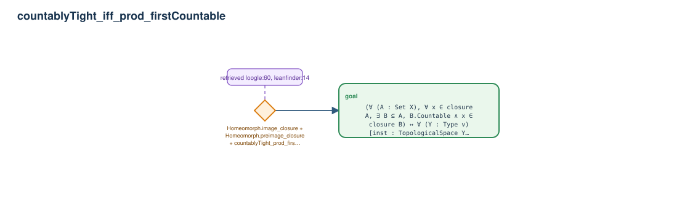

# countablyTight_iff_prod_firstCountable

- Problem index: `1499`
- arXiv source: `math_0409609`
- Selected nodes / hyperedges: **1 / 1**
- Selected depth: **1**
- Retrieval events matched: **6 / 65**
- Incomplete target InfoTree snapshots audited/excluded: **0**
- Validation: original proof re-elaborated; every edge witness kernel-checked in its Lean local context; selected topology compiled as a separate Lean theorem.
- Axioms: `Classical.choice, Quot.sound, propext`
- Concrete certificate: [semantic_graph_certificate.lean](semantic_graph_certificate.lean) embeds the accepted proof and checks every selected raw witness, premise list, and conclusion against this graph.

## Hyperedges

| Edge | Premises | Conclusion | Rule | Retrieval |
|---|---|---|---|---|
| `h_goal` | ∅ | goal | `Homeomorph.image_closure + Homeomorph.preimage_closure + countablyTight_prod_firstCountable` | loogle:60, leanfinder:14, loogle:15, loogle:61, loogle:18, loogle:62 |
