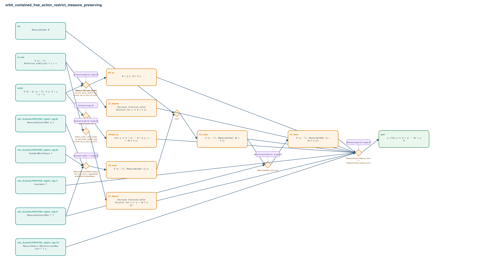

# orbit_contained_free_action_restrict_measure_preserving

- Problem index: `1521`
- arXiv source: `0707.4215`
- Selected nodes / hyperedges: **16 / 8**
- Selected depth: **4**
- Retrieval events matched: **14 / 85**
- Incomplete target InfoTree snapshots audited/excluded: **0**
- Validation: original proof re-elaborated; every edge witness kernel-checked in its Lean local context; selected topology compiled as a separate Lean theorem.
- Axioms: `Classical.choice, Quot.sound, propext`
- Concrete certificate: [semantic_graph_certificate.lean](semantic_graph_certificate.lean) embeds the accepted proof and checks every selected raw witness, premise list, and conclusion against this graph.

## Hyperedges

| Edge | Premises | Conclusion | Rule | Retrieval |
|---|---|---|---|---|
| `h_001_hs_meas` | inst._@.proofs.2709197330._hygCtx._hyg.20, inst._@.proofs.2709197330._hygCtx._hyg.31, inst._@.proofs.2709197330._hygCtx._hyg.35 | hS_meas | `MeasurableConstSMul.measurable_const_smul + UpgradedStandardBorel.toBorelSpace + UpgradedStandardBorel.toPolishSpace` | loogle:17, loogle:85, leanfinder:12, loogle:26, loogle:62 |
| `h_002_hb_eq` | horbit | hB_eq | `Set.ext + Set.mem_iUnion` | — |
| `h_003_hc_meas` | hB, hS_meas | hC_meas | `exact` | — |
| `h_004_hc_disjoint` | hc_free | hC_disjoint | `Rollout_p1521_orbit_contained_free_action_restrict_measu.smul_eq_of_smul_eq_smul_of_stabilizer_bot + Set.disjoint_left` | loogle:52, loogle:53 |
| `h_005_himage_eq` | horbit | himage_eq | `Set.ext + Set.mem_iUnion + Set.mem_smul_set` | loogle:35 |
| `h_006_ht_meas` | inst._@.proofs.2709197330._hygCtx._hyg.31, hC_meas | hT_meas | `MeasurableSet.const_smul` | leanfinder:21, loogle:66, loogle:17 |
| `h_007_ht_disjoint` | hc_free | hT_disjoint | `Rollout_p1521_orbit_contained_free_action_restrict_measu.smul_eq_of_smul_eq_smul_of_stabilizer_bot + Set.disjoint_left + Set.mem_smul_set` | loogle:52, loogle:53, loogle:35, loogle:43 |
| `h_goal` | inst._@.proofs.2709197330._hygCtx._hyg.11, inst._@.proofs.2709197330._hygCtx._hyg.119, hB_eq, hC_meas, hC_disjoint, himage_eq, hT_meas, hT_disjoint | goal | `MeasureTheory.measure_iUnion + MeasureTheory.measure_smul` | loogle:22, loogle:27, loogle:67 |
