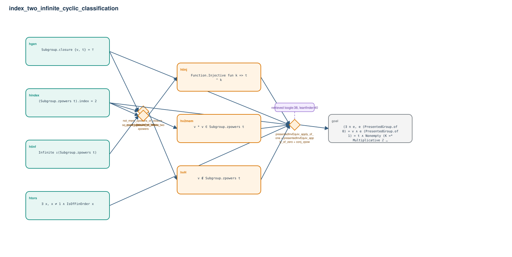

# index_two_infinite_cyclic_classification

- Problem index: `1552`
- arXiv source: `1202.4148`
- Selected nodes / hyperedges: **8 / 4**
- Selected depth: **2**
- Retrieval events matched: **2 / 64**
- Incomplete target InfoTree snapshots audited/excluded: **0**
- Validation: original proof re-elaborated; every edge witness kernel-checked in its Lean local context; selected topology compiled as a separate Lean theorem.
- Axioms: `Classical.choice, Quot.sound, propext`
- Concrete certificate: [semantic_graph_certificate.lean](semantic_graph_certificate.lean) embeds the accepted proof and checks every selected raw witness, premise list, and conclusion against this graph.

## Hyperedges

| Edge | Premises | Conclusion | Rule | Retrieval |
|---|---|---|---|---|
| `h_001_htinj` | htinf | htinj | `zpow_injective_of_infinite_zpowers` | — |
| `h_002_hvh` | hgen, hindex | hvH | `not_mem_zpowers_of_closure_eq_top_index_two` | — |
| `h_003_hv2mem` | hindex | hv2mem | `sq_mem_zpowers_of_index_two` | — |
| `h_goal` | hgen, hindex, htors, htinj, hvH, hv2mem | goal | `presentedInvEquiv_apply_of_one + presentedInvEquiv_apply_of_zero + conj_zpow` | loogle:38, leanfinder:40 |
