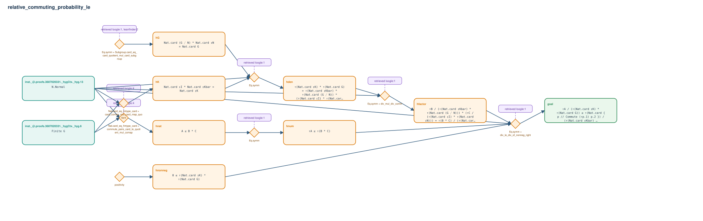

# relative_commuting_probability_le

- Problem index: `1639`
- arXiv source: `2102.06983`
- Selected nodes / hyperedges: **10 / 8**
- Selected depth: **4**
- Retrieval events matched: **3 / 64**
- Incomplete target InfoTree snapshots audited/excluded: **0**
- Validation: original proof re-elaborated; every edge witness kernel-checked in its Lean local context; selected topology compiled as a separate Lean theorem.
- Axioms: `Classical.choice, Quot.sound, propext`
- Concrete certificate: [semantic_graph_certificate.lean](semantic_graph_certificate.lean) embeds the accepted proof and checks every selected raw witness, premise list, and conclusion against this graph.

## Hyperedges

| Edge | Premises | Conclusion | Rule | Retrieval |
|---|---|---|---|---|
| `h_001_hnat` | inst._@.proofs.3607020331._hygCtx._hyg.6, inst._@.proofs.3607020331._hygCtx._hyg.13 | hnat | `Nat.card_eq_fintype_card + commute_pairs_card_le_quotient_mul_comap` | loogle:4 |
| `h_002_hk` | inst._@.proofs.3607020331._hygCtx._hyg.6, inst._@.proofs.3607020331._hygCtx._hyg.13 | hK | `Nat.card_eq_fintype_card + card_comap_mul_card_map_quotient` | loogle:4 |
| `h_003_hg` | ∅ | hG | `Eq.symm + Subgroup.card_eq_card_quotient_mul_card_subgroup` | loogle:1, leanfinder:2 |
| `h_004_hden` | inst._@.proofs.3607020331._hygCtx._hyg.13, hK, hG | hden | `Eq.symm` | loogle:1 |
| `h_005_hnum` | hnat | hnum | `Eq.symm` | loogle:1 |
| `h_006_hnonneg` | ∅ | hnonneg | `positivity` | — |
| `h_007_hfactor` | inst._@.proofs.3607020331._hygCtx._hyg.13, hden | hfactor | `Eq.symm + div_mul_div_comm` | loogle:1 |
| `h_goal` | inst._@.proofs.3607020331._hygCtx._hyg.13, hnum, hnonneg, hfactor | goal | `Eq.symm + div_le_div_of_nonneg_right` | loogle:1 |
