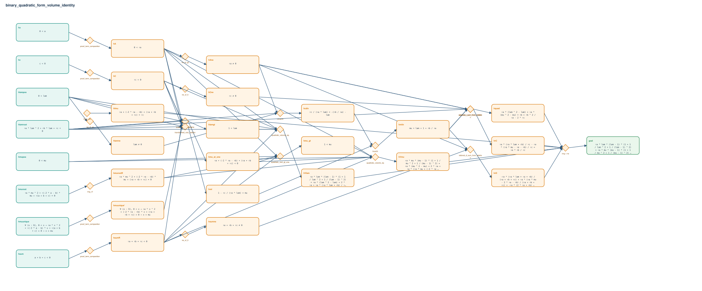

# binary_quadratic_form_volume_identity

- Problem index: `1662`
- arXiv source: `0705.3271`
- Selected nodes / hyperedges: **30 / 22**
- Selected depth: **6**
- Retrieval events matched: **0 / 3**
- Incomplete target InfoTree snapshots audited/excluded: **0**
- Validation: original proof re-elaborated; every edge witness kernel-checked in its Lean local context; selected topology compiled as a separate Lean theorem.
- Axioms: `Classical.choice, Quot.sound, propext`
- Concrete certificate: [semantic_graph_certificate.lean](semantic_graph_certificate.lean) contains a checked theorem for every selected edge and composes them into the final theorem.

## Hyperedges

| Edge | Premises | Conclusion | Rule | Retrieval |
|---|---|---|---|---|
| `h_001_ha` | ha | hA | `proof_term_composition` | — |
| `h_002_hc` | hc | hC | `proof_term_composition` | — |
| `h_003_hsumr` | hsum | hsumR | `proof_term_composition` | — |
| `h_004_hlamgt` | hlamroot, hlampos, hA, hC, hsumR | hlamgt | `quadratic_root_gt_one` | — |
| `h_005_hmurootr` | hmuroot | hmurootR | `ring_nf` | — |
| `h_006_hmu_at_one` | hC | hmu_at_one | `ring + exact + rw` | — |
| `h_007_hmu_gt` | hmupos, hA, hsumR, hmurootR, hmu_at_one | hmu_gt | `quadratic_root_gt_one` | — |
| `h_008_hmuunique` | hmuunique | hmuunique' | `proof_term_composition` | — |
| `h_009_hrel` | hlamroot, hlampos, hA, hC, hmuunique' | hrel | `transformed_root_relation` | — |
| `h_010_hane` | hA | hAne | `ne_of_gt` | — |
| `h_011_hlamne` | hlampos | hlamne | `ne_of_gt` | — |
| `h_012_hcne` | hC | hCne | `ne_of_lt` | — |
| `h_013_hsumne` | hsumR | hsumne | `ne_of_lt` | — |
| `h_014_hcdiv` | hlamroot, hAne, hlamne | hcdiv | `nlinarith` | — |
| `h_015_hmlin` | hrel, hcdiv | hmlin | `linarith` | — |
| `h_016_hvlam` | hlamroot, hlampos, hA, hC, hsumR, hlamgt | hVlam | `quadratic_volume_eq` | — |
| `h_017_hvmu` | hmupos, hA, hsumR, hmurootR, hmu_at_one, hmu_gt | hVmu | `quadratic_volume_eq` | — |
| `h_018_hfmu` | ∅ | hfmu | `ring + rw` | — |
| `h_019_hquad` | hlamroot, hAne, hmlin | hquad | `quadratic_sum_from_relation` | — |
| `h_020_hrc` | hAne, hCne, hmlin | hrC | `rational_c_sum_from_relation` | — |
| `h_021_hrd` | hAne, hsumne, hmlin | hrD | `rational_d_sum_from_relation` | — |
| `h_goal` | hVlam, hVmu, hfmu, hquad, hrC, hrD | goal | `ring + rw` | — |
