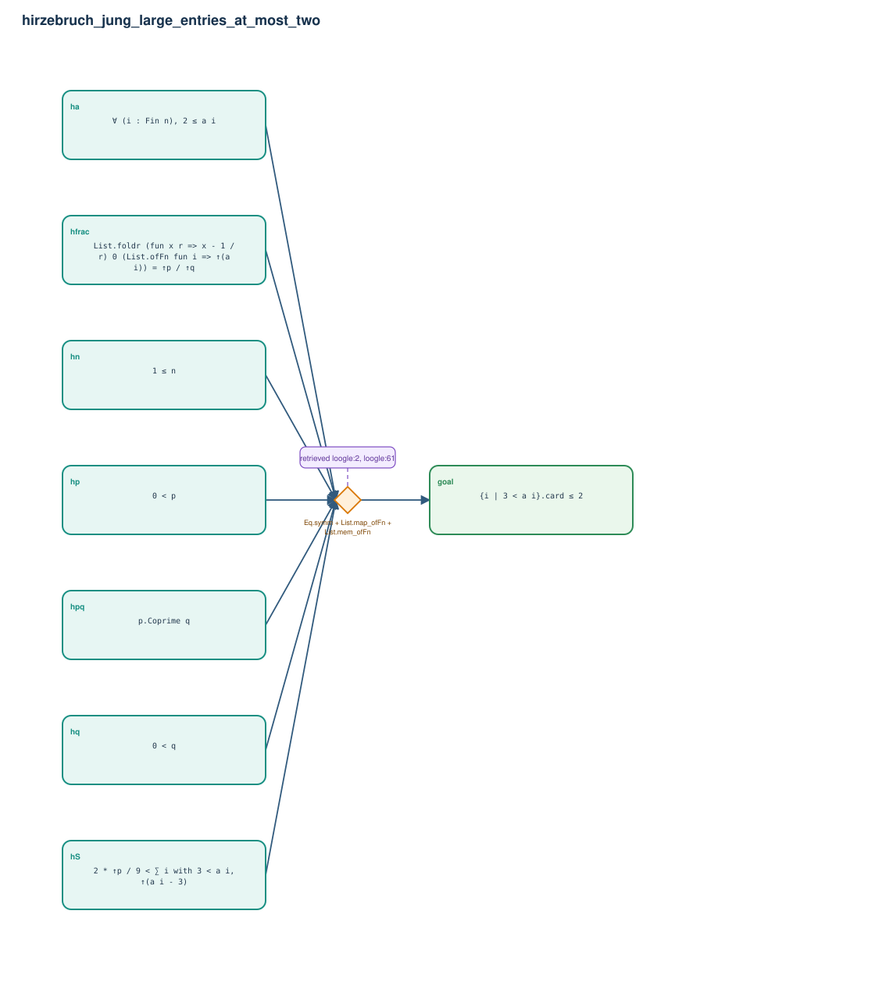

# hirzebruch_jung_large_entries_at_most_two

- Problem index: `1722`
- arXiv source: `math_0405114`
- Selected nodes / hyperedges: **8 / 1**
- Selected depth: **1**
- Retrieval events matched: **8 / 58**
- Incomplete target InfoTree snapshots audited/excluded: **2**
- Validation: original proof re-elaborated; every edge witness kernel-checked in its Lean local context; selected topology compiled as a separate Lean theorem.
- Axioms: `Classical.choice, Quot.sound, propext`
- Concrete certificate: [semantic_graph_certificate.lean](semantic_graph_certificate.lean) embeds the accepted proof and checks every selected raw witness, premise list, and conclusion against this graph.

## Hyperedges

| Edge | Premises | Conclusion | Rule | Retrieval |
|---|---|---|---|---|
| `h_goal` | hn, ha, hp, hq, hpq, hfrac, hS | goal | `Eq.symm + List.map_ofFn + List.mem_ofFn` | loogle:2, loogle:61, loogle:65, loogle:66, loogle:58, leanfinder:28, leanfinder:19, loogle:20 |
