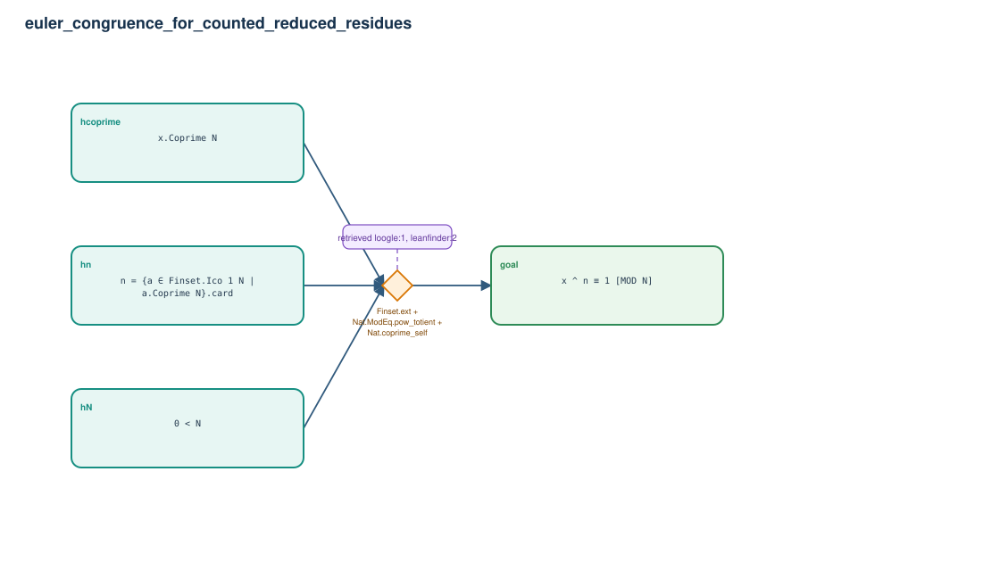

# euler_congruence_for_counted_reduced_residues

- Problem index: `1744`
- arXiv source: `1203.1993`
- Selected nodes / hyperedges: **4 / 1**
- Selected depth: **1**
- Retrieval events matched: **7 / 11**
- Incomplete target InfoTree snapshots audited/excluded: **0**
- Validation: original proof re-elaborated; every edge witness kernel-checked in its Lean local context; selected topology compiled as a separate Lean theorem.
- Axioms: `Classical.choice, Quot.sound, propext`
- Concrete certificate: [semantic_graph_certificate.lean](semantic_graph_certificate.lean) embeds the accepted proof and checks every selected raw witness, premise list, and conclusion against this graph.

## Hyperedges

| Edge | Premises | Conclusion | Rule | Retrieval |
|---|---|---|---|---|
| `h_goal` | hN, hcoprime, hn | goal | `Finset.ext + Nat.ModEq.pow_totient + Nat.coprime_self` | loogle:1, leanfinder:2, loogle:8, loogle:9, leanfinder:3, loogle:11, loogle:12 |
