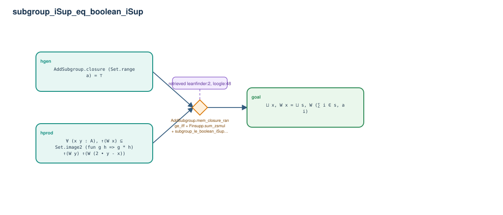

# subgroup_iSup_eq_boolean_iSup

- Problem index: `1776`
- arXiv source: `0911.3628`
- Selected nodes / hyperedges: **3 / 1**
- Selected depth: **1**
- Retrieval events matched: **2 / 35**
- Incomplete target InfoTree snapshots audited/excluded: **0**
- Validation: original proof re-elaborated; every edge witness kernel-checked in its Lean local context; selected topology compiled as a separate Lean theorem.
- Axioms: `Classical.choice, Quot.sound, propext`
- Concrete certificate: [semantic_graph_certificate.lean](semantic_graph_certificate.lean) embeds the accepted proof and checks every selected raw witness, premise list, and conclusion against this graph.

## Hyperedges

| Edge | Premises | Conclusion | Rule | Retrieval |
|---|---|---|---|---|
| `h_goal` | hgen, hprod | goal | `AddSubgroup.mem_closure_range_iff + Finsupp.sum_zsmul + subgroup_le_boolean_iSup_of_int_coeffs` | leanfinder:2, loogle:48 |
