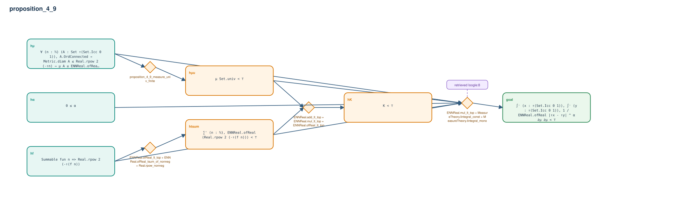

# proposition_4_9

- Problem index: `1874`
- arXiv source: `1405.6312`
- Selected nodes / hyperedges: **7 / 4**
- Selected depth: **3**
- Retrieval events matched: **1 / 76**
- Incomplete target InfoTree snapshots audited/excluded: **0**
- Validation: original proof re-elaborated; every edge witness kernel-checked in its Lean local context; selected topology compiled as a separate Lean theorem.
- Axioms: `Classical.choice, Quot.sound, propext`
- Concrete certificate: [semantic_graph_certificate.lean](semantic_graph_certificate.lean) embeds the accepted proof and checks every selected raw witness, premise list, and conclusion against this graph.

## Hyperedges

| Edge | Premises | Conclusion | Rule | Retrieval |
|---|---|---|---|---|
| `h_001_h_u` | hμ | hμu | `proposition_4_9_measure_univ_finite` | — |
| `h_002_htsum` | hf | htsum | `ENNReal.ofReal_lt_top + ENNReal.ofReal_tsum_of_nonneg + Real.rpow_nonneg` | — |
| `h_003_hk` | hμu, htsum | hK | `ENNReal.add_lt_top + ENNReal.mul_lt_top + ENNReal.ofReal_lt_top` | — |
| `h_goal` | hα, hf, hμ, hμu, hK | goal | `ENNReal.mul_lt_top + MeasureTheory.lintegral_const + MeasureTheory.lintegral_mono` | loogle:8 |
