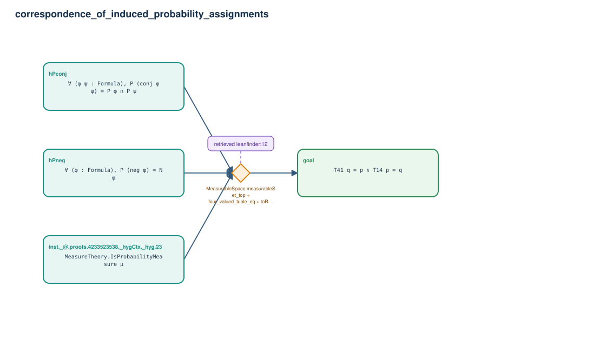

# correspondence_of_induced_probability_assignments

- Problem index: `1918`
- arXiv source: `2003.07408`
- Selected nodes / hyperedges: **4 / 1**
- Selected depth: **1**
- Retrieval events matched: **1 / 14**
- Incomplete target InfoTree snapshots audited/excluded: **0**
- Validation: original proof re-elaborated; every edge witness kernel-checked in its Lean local context; selected topology compiled as a separate Lean theorem.
- Axioms: `Classical.choice, Quot.sound, propext`
- Concrete certificate: [semantic_graph_certificate.lean](semantic_graph_certificate.lean) embeds the accepted proof and checks every selected raw witness, premise list, and conclusion against this graph.

## Hyperedges

| Edge | Premises | Conclusion | Rule | Retrieval |
|---|---|---|---|---|
| `h_goal` | inst._@.proofs.4233523538._hygCtx._hyg.23, hPneg, hPconj | goal | `MeasurableSpace.measurableSet_top + four_valued_tuple_eq + toReal_measure_sdiff_add_inter` | leanfinder:12 |
