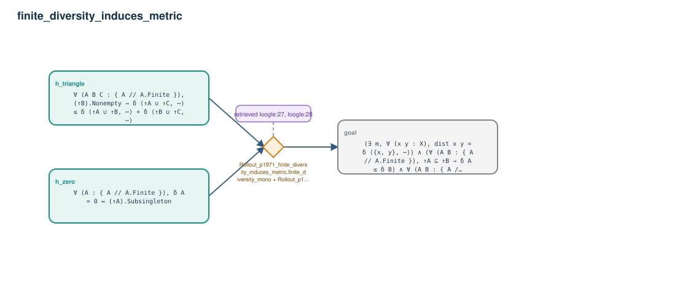

# finite_diversity_induces_metric

- Problem index: `1971`
- arXiv source: `1006.1095`
- Selected nodes / hyperedges: **3 / 1**
- Selected depth: **1**
- Retrieval events matched: **3 / 56**
- Incomplete target InfoTree snapshots audited/excluded: **0**
- Validation: original proof re-elaborated; every edge witness kernel-checked in its Lean local context; selected topology compiled as a separate Lean theorem.
- Axioms: `Classical.choice, Quot.sound, propext`
- Concrete certificate: [semantic_graph_certificate.lean](semantic_graph_certificate.lean) embeds the accepted proof and checks every selected raw witness, premise list, and conclusion against this graph.

## Hyperedges

| Edge | Premises | Conclusion | Rule | Retrieval |
|---|---|---|---|---|
| `h_goal` | h_zero, h_triangle | goal | `Rollout_p1971_finite_diversity_induces_metric.finite_diversity_mono + Rollout_p1971_finite_diversity_induces_metric.finite_diversity_pair_eq + Rollout_p1971_finite_diversity_induces_metric.finite_diversity_union_le` | loogle:27, loogle:28, loogle:38 |
