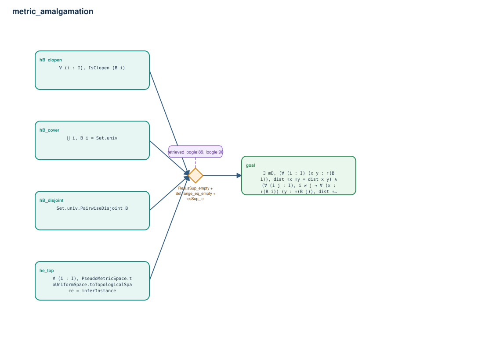

# metric_amalgamation

- Problem index: `2075`
- arXiv source: `2104.12450`
- Selected nodes / hyperedges: **5 / 1**
- Selected depth: **1**
- Retrieval events matched: **5 / 38**
- Incomplete target InfoTree snapshots audited/excluded: **0**
- Validation: original proof re-elaborated; every edge witness kernel-checked in its Lean local context; selected topology compiled as a separate Lean theorem.
- Axioms: `Classical.choice, Quot.sound, propext`
- Concrete certificate: [semantic_graph_certificate.lean](semantic_graph_certificate.lean) embeds the accepted proof and checks every selected raw witness, premise list, and conclusion against this graph.

## Hyperedges

| Edge | Premises | Conclusion | Rule | Retrieval |
|---|---|---|---|---|
| `h_goal` | hB_disjoint, hB_clopen, hB_cover, he_top | goal | `Real.sSup_empty + Set.range_eq_empty + csSup_le` | loogle:89, loogle:90, loogle:91, loogle:85, loogle:87 |
