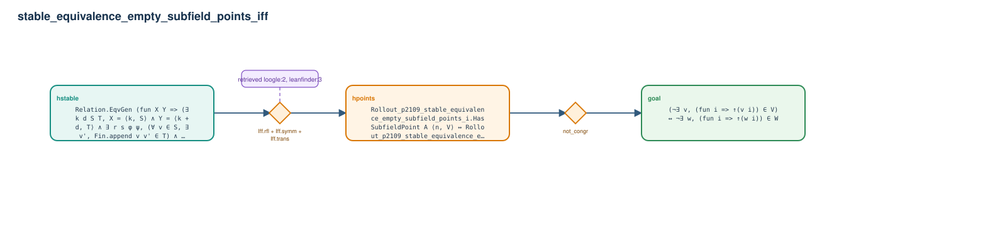

# stable_equivalence_empty_subfield_points_iff

- Problem index: `2109`
- arXiv source: `math_9510217`
- Selected nodes / hyperedges: **3 / 2**
- Selected depth: **2**
- Retrieval events matched: **2 / 118**
- Incomplete target InfoTree snapshots audited/excluded: **0**
- Validation: original proof re-elaborated; every edge witness kernel-checked in its Lean local context; selected topology compiled as a separate Lean theorem.
- Axioms: `Classical.choice, Quot.sound, propext`
- Concrete certificate: [semantic_graph_certificate.lean](semantic_graph_certificate.lean) embeds the accepted proof and checks every selected raw witness, premise list, and conclusion against this graph.

## Hyperedges

| Edge | Premises | Conclusion | Rule | Retrieval |
|---|---|---|---|---|
| `h_001_hpoints` | hstable | hpoints | `Iff.rfl + Iff.symm + Iff.trans` | loogle:2, leanfinder:3 |
| `h_goal` | hpoints | goal | `not_congr` | — |
