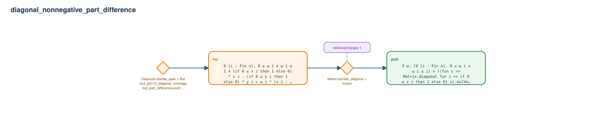

# diagonal_nonnegative_part_difference

- Problem index: `2112`
- arXiv source: `0912.3222`
- Selected nodes / hyperedges: **2 / 2**
- Selected depth: **2**
- Retrieval events matched: **1 / 10**
- Incomplete target InfoTree snapshots audited/excluded: **0**
- Validation: original proof re-elaborated; every edge witness kernel-checked in its Lean local context; selected topology compiled as a separate Lean theorem.
- Axioms: `Classical.choice, Quot.sound, propext`
- Concrete certificate: [semantic_graph_certificate.lean](semantic_graph_certificate.lean) embeds the accepted proof and checks every selected raw witness, premise list, and conclusion against this graph.

## Hyperedges

| Edge | Premises | Conclusion | Rule | Retrieval |
|---|---|---|---|---|
| `h_001_h` | ∅ | hω | `Classical.choose_spec + Rollout_p2112_diagonal_nonnegative_part_difference.positive_part_secant_aux` | — |
| `h_goal` | hω | goal | `Matrix.mulVec_diagonal + funext` | loogle:1 |
