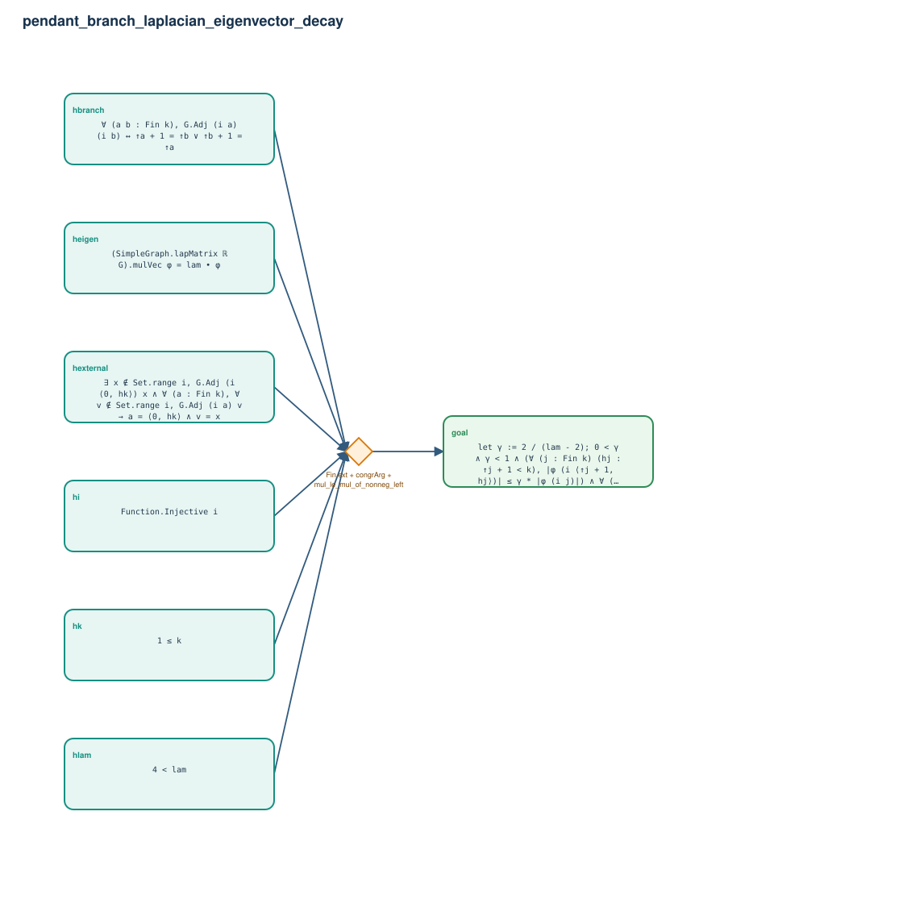

# pendant_branch_laplacian_eigenvector_decay

- Problem index: `2116`
- arXiv source: `1112.4526`
- Selected nodes / hyperedges: **7 / 1**
- Selected depth: **1**
- Retrieval events matched: **0 / 21**
- Incomplete target InfoTree snapshots audited/excluded: **17**
- Validation: original proof re-elaborated; every edge witness kernel-checked in its Lean local context; selected topology compiled as a separate Lean theorem.
- Axioms: `Classical.choice, Quot.sound, propext`
- Concrete certificate: [semantic_graph_certificate.lean](semantic_graph_certificate.lean) embeds the accepted proof and checks every selected raw witness, premise list, and conclusion against this graph.

## Hyperedges

| Edge | Premises | Conclusion | Rule | Retrieval |
|---|---|---|---|---|
| `h_goal` | hk, hi, hbranch, hexternal, hlam, heigen | goal | `Fin.ext + congrArg + mul_le_mul_of_nonneg_left` | — |
