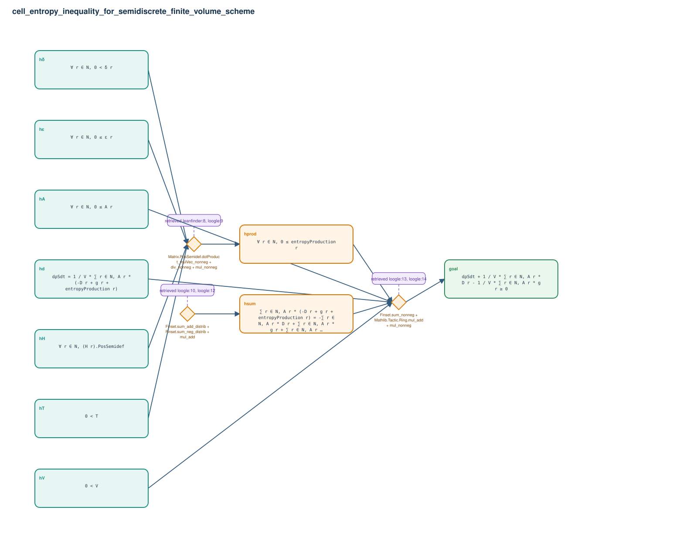

# cell_entropy_inequality_for_semidiscrete_finite_volume_scheme

- Problem index: `2161`
- arXiv source: `2301.08282`
- Selected nodes / hyperedges: **10 / 3**
- Selected depth: **2**
- Retrieval events matched: **6 / 15**
- Incomplete target InfoTree snapshots audited/excluded: **0**
- Validation: original proof re-elaborated; every edge witness kernel-checked in its Lean local context; selected topology compiled as a separate Lean theorem.
- Axioms: `Classical.choice, Quot.sound, propext`
- Concrete certificate: [semantic_graph_certificate.lean](semantic_graph_certificate.lean) embeds the accepted proof and checks every selected raw witness, premise list, and conclusion against this graph.

## Hyperedges

| Edge | Premises | Conclusion | Rule | Retrieval |
|---|---|---|---|---|
| `h_001_hprod` | hδ, hε, hT, hH | hprod | `Matrix.PosSemidef.dotProduct_mulVec_nonneg + div_nonneg + mul_nonneg` | leanfinder:8, loogle:9 |
| `h_002_hsum` | ∅ | hsum | `Finset.sum_add_distrib + Finset.sum_neg_distrib + mul_add` | loogle:10, loogle:12 |
| `h_goal` | hV, hA, hd, hprod, hsum | goal | `Finset.sum_nonneg + Mathlib.Tactic.Ring.mul_add + mul_nonneg` | loogle:13, loogle:14 |
