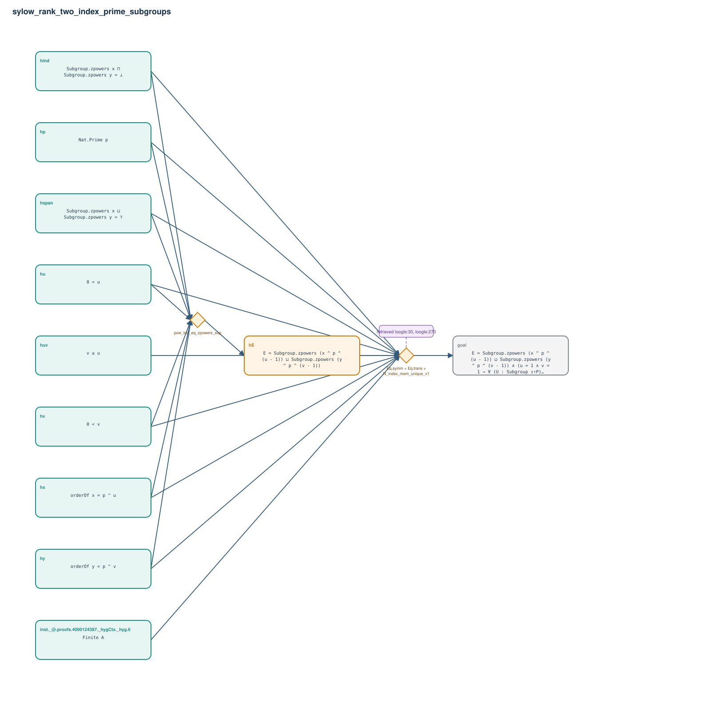

# sylow_rank_two_index_prime_subgroups

- Problem index: `2247`
- arXiv source: `1605.03695`
- Selected nodes / hyperedges: **11 / 2**
- Selected depth: **2**
- Retrieval events matched: **2 / 224**
- Incomplete target InfoTree snapshots audited/excluded: **0**
- Validation: original proof re-elaborated; every edge witness kernel-checked in its Lean local context; selected topology compiled as a separate Lean theorem.
- Axioms: `Classical.choice, Quot.sound, propext`
- Concrete certificate: [semantic_graph_certificate.lean](semantic_graph_certificate.lean) embeds the accepted proof and checks every selected raw witness, premise list, and conclusion against this graph.

## Hyperedges

| Edge | Premises | Conclusion | Rule | Retrieval |
|---|---|---|---|---|
| `h_001_he` | hp, hu, hv, hx, hy, hspan, hind | hE | `pow_ker_eq_zpowers_sup` | — |
| `h_goal` | inst._@.proofs.4000124397._hygCtx._hyg.6, hp, hu, hv, huv, hx, hy, hspan, hind, hE | goal | `Eq.symm + Eq.trans + N_index_mem_unique_v1` | loogle:30, loogle:270 |
