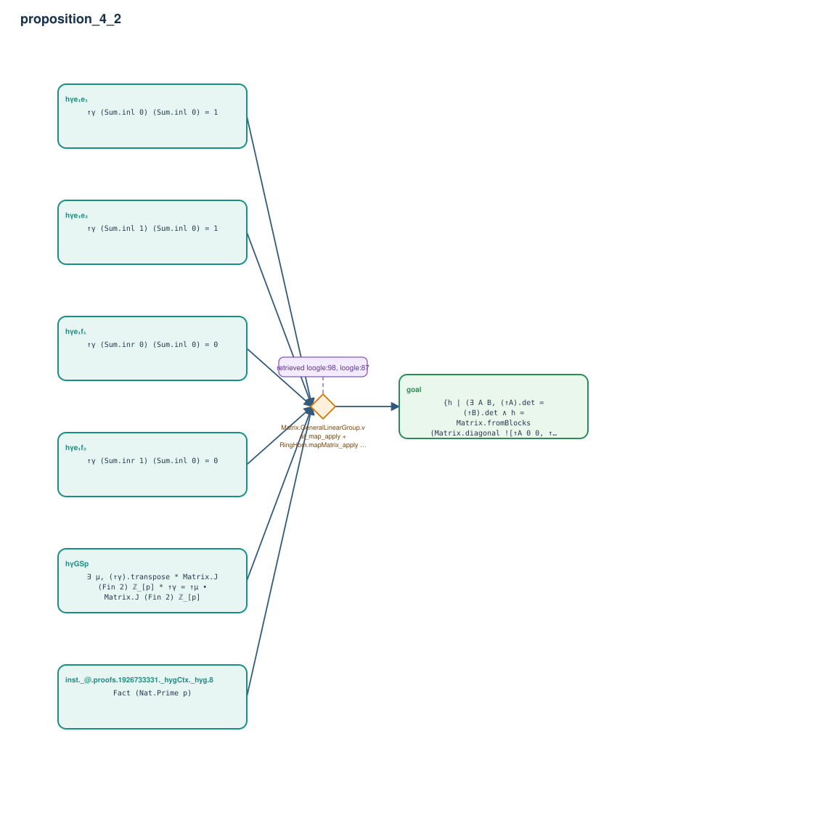

# proposition_4_2

- Problem index: `2272`
- arXiv source: `1905.08779`
- Selected nodes / hyperedges: **7 / 1**
- Selected depth: **1**
- Retrieval events matched: **5 / 53**
- Incomplete target InfoTree snapshots audited/excluded: **0**
- Validation: original proof re-elaborated; every edge witness kernel-checked in its Lean local context; selected topology compiled as a separate Lean theorem.
- Axioms: `Classical.choice, Quot.sound, propext`
- Concrete certificate: [semantic_graph_certificate.lean](semantic_graph_certificate.lean) embeds the accepted proof and checks every selected raw witness, premise list, and conclusion against this graph.

## Hyperedges

| Edge | Premises | Conclusion | Rule | Retrieval |
|---|---|---|---|---|
| `h_goal` | inst._@.proofs.1926733331._hygCtx._hyg.8, hγGSp, hγe₁e₁, hγe₁e₂, hγe₁f₁, hγe₁f₂ | goal | `Matrix.GeneralLinearGroup.val_map_apply + RingHom.mapMatrix_apply + RingHom.map_det` | loogle:98, loogle:87, loogle:99, leanfinder:84, leanfinder:7 |
