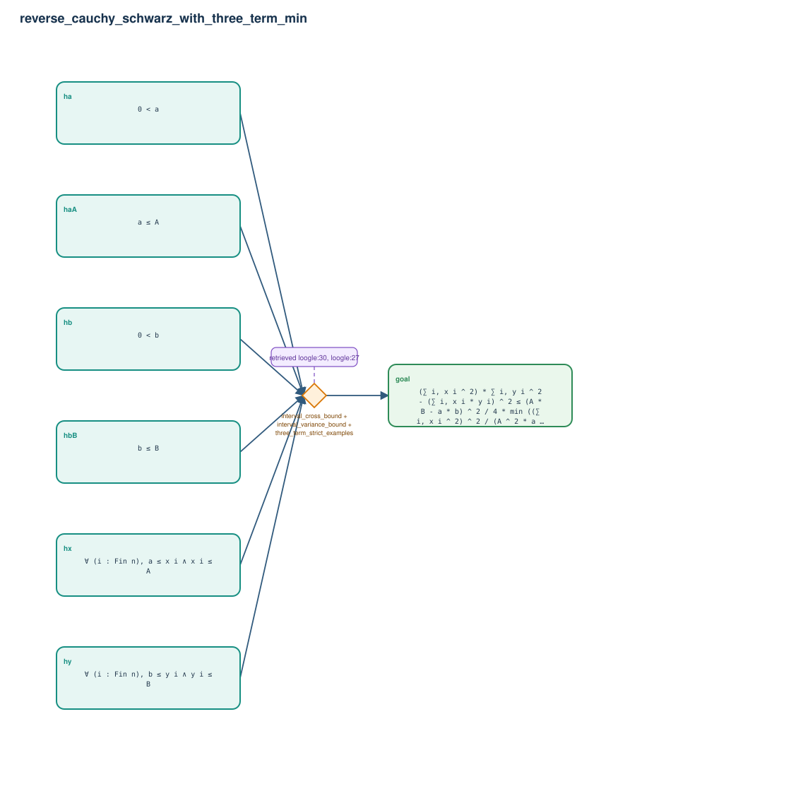

# reverse_cauchy_schwarz_with_three_term_min

- Problem index: `2331`
- arXiv source: `0905.4065`
- Selected nodes / hyperedges: **7 / 1**
- Selected depth: **1**
- Retrieval events matched: **3 / 24**
- Incomplete target InfoTree snapshots audited/excluded: **0**
- Validation: original proof re-elaborated; every edge witness kernel-checked in its Lean local context; selected topology compiled as a separate Lean theorem.
- Axioms: `Classical.choice, Quot.sound, propext`
- Concrete certificate: [semantic_graph_certificate.lean](semantic_graph_certificate.lean) embeds the accepted proof and checks every selected raw witness, premise list, and conclusion against this graph.

## Hyperedges

| Edge | Premises | Conclusion | Rule | Retrieval |
|---|---|---|---|---|
| `h_goal` | ha, haA, hb, hbB, hx, hy | goal | `interval_cross_bound + interval_variance_bound + three_term_strict_examples` | loogle:30, loogle:27, loogle:29 |
