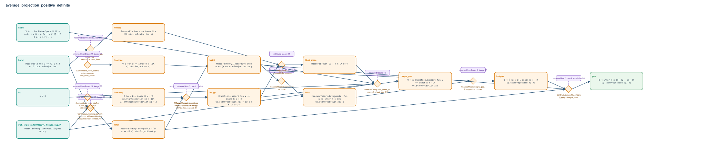

# average_projection_positive_definite

- Problem index: `2468`
- arXiv source: `2004.13356`
- Selected nodes / hyperedges: **15 / 11**
- Selected depth: **6**
- Retrieval events matched: **19 / 73**
- Incomplete target InfoTree snapshots audited/excluded: **0**
- Validation: original proof re-elaborated; every edge witness kernel-checked in its Lean local context; selected topology compiled as a separate Lean theorem.
- Axioms: `Classical.choice, Quot.sound, propext`
- Concrete certificate: [semantic_graph_certificate.lean](semantic_graph_certificate.lean) embeds the accepted proof and checks every selected raw witness, premise list, and conclusion against this graph.

## Hyperedges

| Edge | Premises | Conclusion | Rule | Retrieval |
|---|---|---|---|---|
| `h_001_hpint` | inst._@.proofs.1509888941._hygCtx._hyg.17, hproj | hPint | `ContinuousLinearMap.opNorm_le_bound + Measurable.aestronglyMeasurable + MeasureTheory.Integrable.of_bound` | leanfinder:52, loogle:18, leanfinder:51 |
| `h_002_h_int` | hPint | hφint | `MeasureTheory.Integrable.apply_continuousLinearMap` | leanfinder:58, leanfinder:59 |
| `h_003_hfint` | hφint | hfint | `MeasureTheory.Integrable.const_inner` | leanfinder:65, loogle:33 |
| `h_004_hfmeas` | hproj | hfmeas | `Measurable.apply_continuousLinearMap + Measurable.const_inner` | leanfinder:59, leanfinder:58, loogle:33, leanfinder:65 |
| `h_005_hnonneg` | ∅ | hnonneg | `Submodule.re_inner_starProjection_nonneg + real_inner_comm` | leanfinder:22, loogle:28, loogle:30 |
| `h_006_hnormsq` | ∅ | hnormsq | `Submodule.re_inner_starProjection_eq_normSq + real_inner_comm` | leanfinder:23, loogle:29, loogle:30 |
| `h_007_hsupp` | hnormsq | hsupp | `Function.mem_support + Set.ext + Submodule.orthogonalProjection_eq_zero_iff` | leanfinder:9 |
| `h_008_hbad_meas` | hfmeas, hsupp | hbad_meas | `compl_compl + measurableSet_support` | loogle:35 |
| `h_009_hsupp_pos` | inst._@.proofs.1509888941._hygCtx._hyg.17, hadm, hx, hsupp, hbad_meas | hsupp_pos | `MeasureTheory.prob_compl_eq_one_sub + tsub_pos_iff_lt` | loogle:78 |
| `h_010_hintpos` | hfint, hnonneg, hsupp_pos | hintpos | `MeasureTheory.integral_pos_iff_support_of_nonneg` | leanfinder:5, loogle:10 |
| `h_goal` | hPint, hφint, hintpos | goal | `ContinuousLinearMap.integral_apply + integral_inner` | leanfinder:4, leanfinder:26, leanfinder:65 |
