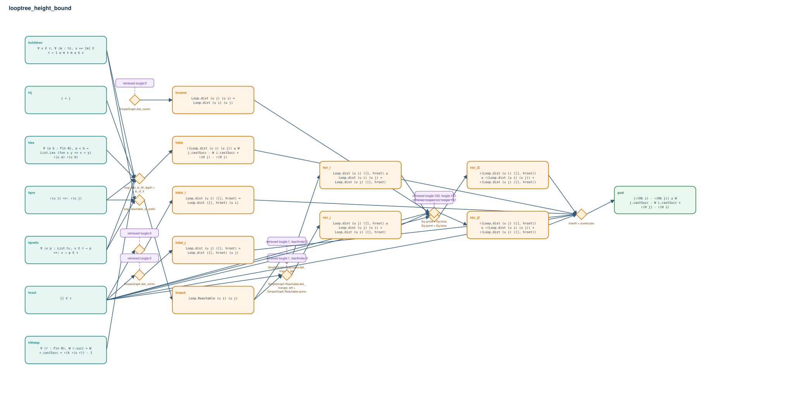

# looptree_height_bound

- Problem index: `2581`
- arXiv source: `1802.00647`
- Selected nodes / hyperedges: **17 / 10**
- Selected depth: **4**
- Retrieval events matched: **7 / 94**
- Incomplete target InfoTree snapshots audited/excluded: **0**
- Validation: original proof re-elaborated; every edge witness kernel-checked in its Lean local context; selected topology compiled as a separate Lean theorem.
- Axioms: `Classical.choice, Quot.sound, propext`
- Concrete certificate: [semantic_graph_certificate.lean](semantic_graph_certificate.lean) embeds the accepted proof and checks every selected raw witness, premise list, and conclusion against this graph.

## Hyperedges

| Edge | Premises | Conclusion | Rule | Retrieval |
|---|---|---|---|---|
| `h_001_hreach` | hprefix, hchildren, hpre | hreach | `loop_reachable_of_prefix` | — |
| `h_002_hdist` | hprefix, hchildren, hlex, hWstep, hij, hpre | hdist | `loop_dist_le_W_depth + le_of_lt` | — |
| `h_003_htri_i` | hroot, hreach | htri_i | `SimpleGraph.Reachable.dist_triangle_left` | loogle:1, leanfinder:3, loogle:125 |
| `h_004_htri_j` | hroot, hreach | htri_j | `SimpleGraph.Reachable.dist_triangle_left + SimpleGraph.Reachable.symm` | loogle:1, leanfinder:3, loogle:125, loogle:142, loogle:120 |
| `h_005_hcomm` | ∅ | hcomm | `SimpleGraph.dist_comm` | loogle:0 |
| `h_006_htri_iz` | hroot, htri_i | htri_iZ | `Eq.symm + Eq.trans` | loogle:120, loogle:142, loogle:4 |
| `h_007_htri_jz` | hroot, htri_j, hcomm | htri_jZ | `Eq.symm + Eq.trans` | loogle:120, loogle:142, loogle:4 |
| `h_008_hdist_i` | hroot | hdist_i | `SimpleGraph.dist_comm` | loogle:0 |
| `h_009_hdist_j` | hroot | hdist_j | `SimpleGraph.dist_comm` | loogle:0 |
| `h_goal` | hroot, hdist, htri_iZ, htri_jZ, hdist_i, hdist_j | goal | `linarith + constructor` | — |
