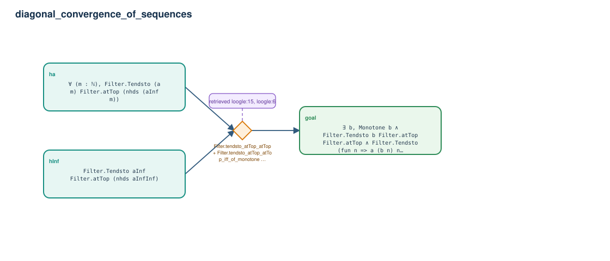

# diagonal_convergence_of_sequences

- Problem index: `2604`
- arXiv source: `2101.00906`
- Selected nodes / hyperedges: **3 / 1**
- Selected depth: **1**
- Retrieval events matched: **6 / 25**
- Incomplete target InfoTree snapshots audited/excluded: **0**
- Validation: original proof re-elaborated; every edge witness kernel-checked in its Lean local context; selected topology compiled as a separate Lean theorem.
- Axioms: `Classical.choice, Quot.sound, propext`
- Concrete certificate: [semantic_graph_certificate.lean](semantic_graph_certificate.lean) embeds the accepted proof and checks every selected raw witness, premise list, and conclusion against this graph.

## Hyperedges

| Edge | Premises | Conclusion | Rule | Retrieval |
|---|---|---|---|---|
| `h_goal` | ha, hInf | goal | `Filter.tendsto_atTop_atTop + Filter.tendsto_atTop_atTop_iff_of_monotone + Finset.le_sup` | loogle:15, loogle:6, loogle:7, loogle:0, loogle:8, loogle:1 |
