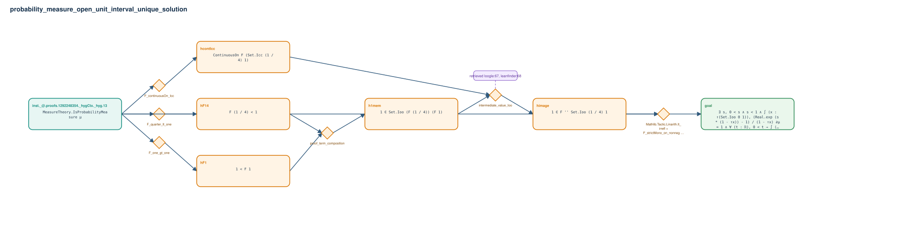

# probability_measure_open_unit_interval_unique_solution

- Problem index: `2625`
- arXiv source: `math_0602278`
- Selected nodes / hyperedges: **7 / 6**
- Selected depth: **4**
- Retrieval events matched: **2 / 46**
- Incomplete target InfoTree snapshots audited/excluded: **0**
- Validation: original proof re-elaborated; every edge witness kernel-checked in its Lean local context; selected topology compiled as a separate Lean theorem.
- Axioms: `Classical.choice, Quot.sound, propext`
- Concrete certificate: [semantic_graph_certificate.lean](semantic_graph_certificate.lean) embeds the accepted proof and checks every selected raw witness, premise list, and conclusion against this graph.

## Hyperedges

| Edge | Premises | Conclusion | Rule | Retrieval |
|---|---|---|---|---|
| `h_001_hconticc` | inst._@.proofs.1292248354._hygCtx._hyg.13 | hcontIcc | `F_continuousOn_Icc` | — |
| `h_002_hf14` | inst._@.proofs.1292248354._hygCtx._hyg.13 | hF14 | `F_quarter_lt_one` | — |
| `h_003_hf1` | inst._@.proofs.1292248354._hygCtx._hyg.13 | hF1 | `F_one_gt_one` | — |
| `h_004_h1mem` | hF14, hF1 | h1mem | `proof_term_composition` | — |
| `h_005_himage` | hcontIcc, h1mem | himage | `intermediate_value_Ioo` | loogle:67, leanfinder:68 |
| `h_goal` | inst._@.proofs.1292248354._hygCtx._hyg.13, himage | goal | `Mathlib.Tactic.Linarith.lt_irrefl + F_strictMono_on_nonneg + lt_irrefl` | — |
