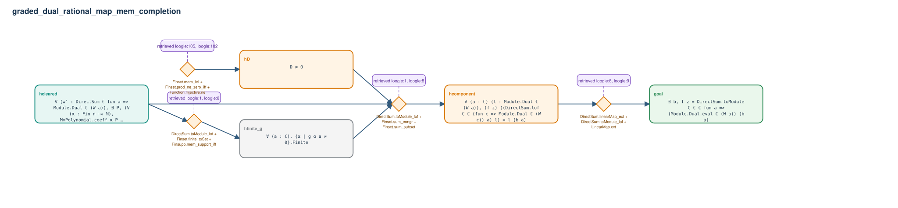

# graded_dual_rational_map_mem_completion

- Problem index: `2674`
- arXiv source: `1804.07424`
- Selected nodes / hyperedges: **5 / 4**
- Selected depth: **3**
- Retrieval events matched: **19 / 106**
- Incomplete target InfoTree snapshots audited/excluded: **0**
- Validation: original proof re-elaborated; every edge witness kernel-checked in its Lean local context; selected topology compiled as a separate Lean theorem.
- Axioms: `Classical.choice, Quot.sound, propext`
- Concrete certificate: [semantic_graph_certificate.lean](semantic_graph_certificate.lean) embeds the accepted proof and checks every selected raw witness, premise list, and conclusion against this graph.

## Hyperedges

| Edge | Premises | Conclusion | Rule | Retrieval |
|---|---|---|---|---|
| `h_001_hfinite_g` | hcleared | hfinite_g | `DirectSum.toModule_lof + Finset.finite_toSet + Finsupp.mem_support_iff` | loogle:1, loogle:8, loogle:9, loogle:86, loogle:115, loogle:2, loogle:58 |
| `h_002_hd` | ∅ | hD | `Finset.mem_Ioi + Finset.prod_ne_zero_iff + Function.Injective.ne` | loogle:105, loogle:102, loogle:104, loogle:103, loogle:101 |
| `h_003_hcomponent` | hcleared, hfinite_g, hD | hcomponent | `DirectSum.toModule_lof + Finset.sum_congr + Finset.sum_subset` | loogle:1, loogle:8, loogle:9, loogle:112, loogle:111, loogle:2, loogle:99, loogle:97, loogle:96, loogle:115, loogle:86 |
| `h_goal` | hcomponent | goal | `DirectSum.linearMap_ext + DirectSum.toModule_lof + LinearMap.ext` | loogle:6, loogle:9, loogle:1, loogle:8, loogle:11, loogle:2 |
