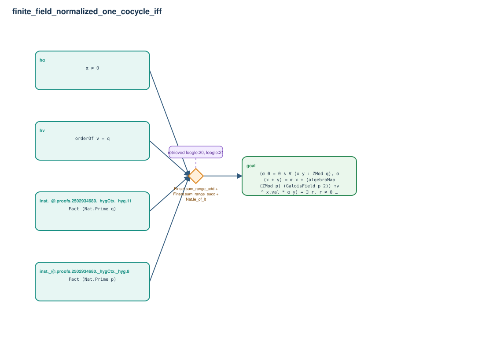

# finite_field_normalized_one_cocycle_iff

- Problem index: `2697`
- arXiv source: `math_0209210`
- Selected nodes / hyperedges: **5 / 1**
- Selected depth: **1**
- Retrieval events matched: **10 / 24**
- Incomplete target InfoTree snapshots audited/excluded: **0**
- Validation: original proof re-elaborated; every edge witness kernel-checked in its Lean local context; selected topology compiled as a separate Lean theorem.
- Axioms: `Classical.choice, Quot.sound, propext`
- Concrete certificate: [semantic_graph_certificate.lean](semantic_graph_certificate.lean) embeds the accepted proof and checks every selected raw witness, premise list, and conclusion against this graph.

## Hyperedges

| Edge | Premises | Conclusion | Rule | Retrieval |
|---|---|---|---|---|
| `h_goal` | inst._@.proofs.2502934680._hygCtx._hyg.8, inst._@.proofs.2502934680._hygCtx._hyg.11, hν, hα | goal | `Finset.sum_range_add + Finset.sum_range_succ + Nat.le_of_lt` | loogle:20, loogle:21, leanfinder:23, loogle:2, loogle:11, leanfinder:10, loogle:13, leanfinder:18, loogle:0, leanfinder:4 |
