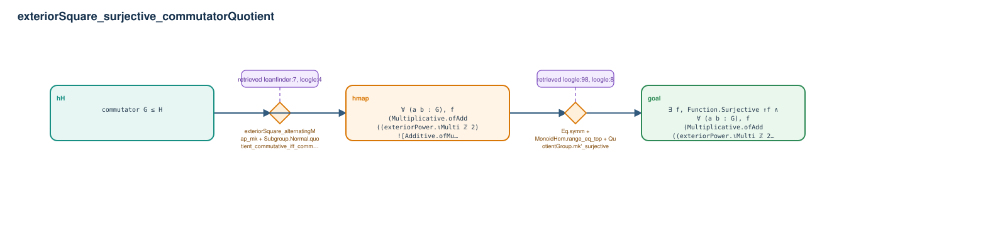

# exteriorSquare_surjective_commutatorQuotient

- Problem index: `2732`
- arXiv source: `0812.3433`
- Selected nodes / hyperedges: **3 / 2**
- Selected depth: **2**
- Retrieval events matched: **8 / 98**
- Incomplete target InfoTree snapshots audited/excluded: **0**
- Validation: original proof re-elaborated; every edge witness kernel-checked in its Lean local context; selected topology compiled as a separate Lean theorem.
- Axioms: `Classical.choice, Quot.sound, propext`
- Concrete certificate: [semantic_graph_certificate.lean](semantic_graph_certificate.lean) embeds the accepted proof and checks every selected raw witness, premise list, and conclusion against this graph.

## Hyperedges

| Edge | Premises | Conclusion | Rule | Retrieval |
|---|---|---|---|---|
| `h_001_hmap` | hH | hmap | `exteriorSquare_alternatingMap_mk + Subgroup.Normal.quotient_commutative_iff_commutator_le + Subgroup.commutator_mem_commutator` | leanfinder:7, loogle:4 |
| `h_goal` | hH, hmap | goal | `Eq.symm + MonoidHom.range_eq_top + QuotientGroup.mk'_surjective` | loogle:98, loogle:8, loogle:10, leanfinder:7, loogle:164, loogle:168, loogle:4, loogle:109 |
