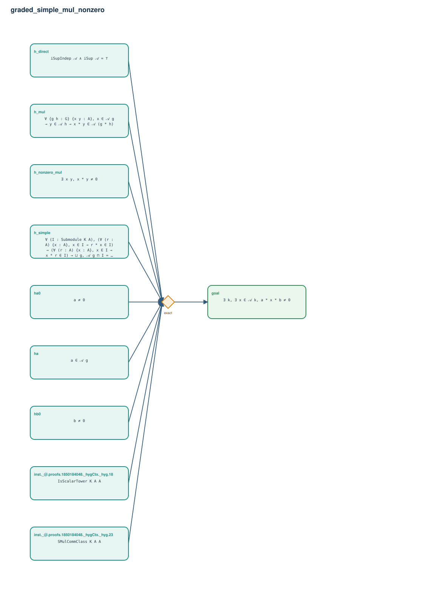

# graded_simple_mul_nonzero

- Problem index: `2763`
- arXiv source: `1112.5492`
- Selected nodes / hyperedges: **10 / 1**
- Selected depth: **1**
- Retrieval events matched: **0 / 25**
- Incomplete target InfoTree snapshots audited/excluded: **0**
- Validation: original proof re-elaborated; every edge witness kernel-checked in its Lean local context; selected topology compiled as a separate Lean theorem.
- Axioms: `Classical.choice, Quot.sound, propext`
- Concrete certificate: [semantic_graph_certificate.lean](semantic_graph_certificate.lean) embeds the accepted proof and checks every selected raw witness, premise list, and conclusion against this graph.

## Hyperedges

| Edge | Premises | Conclusion | Rule | Retrieval |
|---|---|---|---|---|
| `h_goal` | inst._@.proofs.1850184048._hygCtx._hyg.18, inst._@.proofs.1850184048._hygCtx._hyg.23, h_direct, h_mul, h_nonzero_mul, h_simple, ha, ha0, hb0 | goal | `exact` | — |
