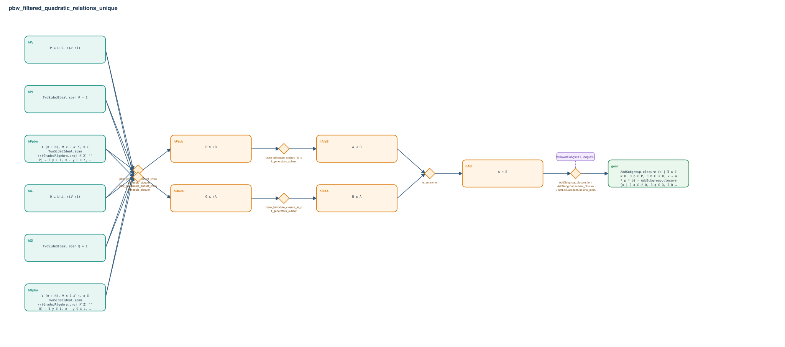

# pbw_filtered_quadratic_relations_unique

- Problem index: `2771`
- arXiv source: `1209.5660`
- Selected nodes / hyperedges: **12 / 6**
- Selected depth: **4**
- Retrieval events matched: **3 / 95**
- Incomplete target InfoTree snapshots audited/excluded: **0**
- Validation: original proof re-elaborated; every edge witness kernel-checked in its Lean local context; selected topology compiled as a separate Lean theorem.
- Axioms: `Classical.choice, Quot.sound, propext`
- Concrete certificate: [semantic_graph_certificate.lean](semantic_graph_certificate.lean) embeds the accepted proof and checks every selected raw witness, premise list, and conclusion against this graph.

## Hyperedges

| Edge | Premises | Conclusion | Rule | Retrieval |
|---|---|---|---|---|
| `h_001_hpsub` | hP₂, hQ₂, hPI, hQI, hPpbw, hQpbw | hPsub | `pbw_generators_subset_tzero_bimodule_closure` | — |
| `h_002_hqsub` | hP₂, hQ₂, hPI, hQI, hPpbw, hQpbw | hQsub | `pbw_generators_subset_tzero_bimodule_closure` | — |
| `h_003_haleb` | hPsub | hAleB | `tzero_bimodule_closure_le_of_generators_subset` | — |
| `h_004_hblea` | hQsub | hBleA | `tzero_bimodule_closure_le_of_generators_subset` | — |
| `h_005_hab` | hAleB, hBleA | hAB | `le_antisymm` | — |
| `h_goal` | hAB | goal | `AddSubgroup.closure_le + AddSubgroup.subset_closure + SetLike.GradedOne.one_mem` | loogle:41, loogle:42, loogle:77 |
