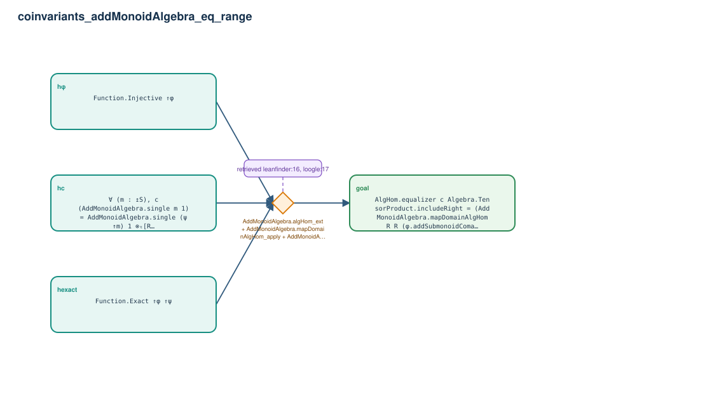

# coinvariants_addMonoidAlgebra_eq_range

- Problem index: `2937`
- arXiv source: `1307.3066`
- Selected nodes / hyperedges: **4 / 1**
- Selected depth: **1**
- Retrieval events matched: **11 / 41**
- Incomplete target InfoTree snapshots audited/excluded: **0**
- Validation: original proof re-elaborated; every edge witness kernel-checked in its Lean local context; selected topology compiled as a separate Lean theorem.
- Axioms: `Classical.choice, Quot.sound, propext`
- Concrete certificate: [semantic_graph_certificate.lean](semantic_graph_certificate.lean) embeds the accepted proof and checks every selected raw witness, premise list, and conclusion against this graph.

## Hyperedges

| Edge | Premises | Conclusion | Rule | Retrieval |
|---|---|---|---|---|
| `h_goal` | hφ, hexact, hc | goal | `AddMonoidAlgebra.algHom_ext + AddMonoidAlgebra.mapDomainAlgHom_apply + AddMonoidAlgebra.mapDomain_comapDomain` | leanfinder:16, loogle:17, leanfinder:1, loogle:2, loogle:7, loogle:75, loogle:3, loogle:58, loogle:59, loogle:64, loogle:63 |
