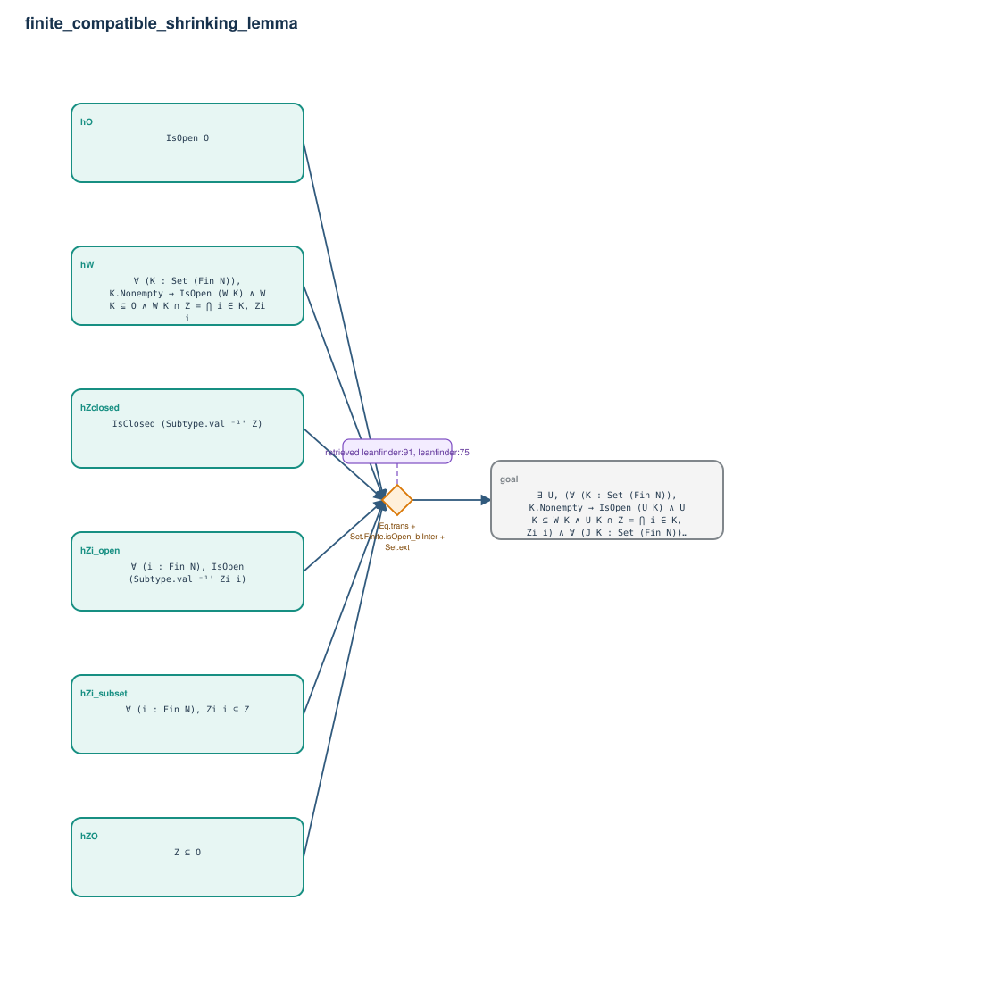

# finite_compatible_shrinking_lemma

- Problem index: `3013`
- arXiv source: `1208.1340`
- Selected nodes / hyperedges: **7 / 1**
- Selected depth: **1**
- Retrieval events matched: **7 / 136**
- Incomplete target InfoTree snapshots audited/excluded: **0**
- Validation: original proof re-elaborated; every edge witness kernel-checked in its Lean local context; selected topology compiled as a separate Lean theorem.
- Axioms: `Classical.choice, Quot.sound, propext`
- Concrete certificate: [semantic_graph_certificate.lean](semantic_graph_certificate.lean) embeds the accepted proof and checks every selected raw witness, premise list, and conclusion against this graph.

## Hyperedges

| Edge | Premises | Conclusion | Rule | Retrieval |
|---|---|---|---|---|
| `h_goal` | hO, hZO, hZclosed, hZi_subset, hZi_open, hW | goal | `Eq.trans + Set.Finite.isOpen_biInter + Set.ext` | leanfinder:91, leanfinder:75, loogle:120, leanfinder:16, leanfinder:39, leanfinder:70, loogle:125 |
