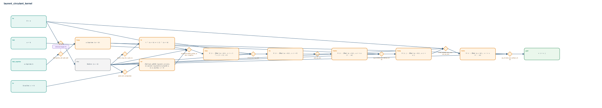

# laurent_circulant_kernel

- Problem index: `3019`
- arXiv source: `1403.7571`
- Selected nodes / hyperedges: **14 / 10**
- Selected depth: **8**
- Retrieval events matched: **1 / 46**
- Incomplete target InfoTree snapshots audited/excluded: **0**
- Validation: original proof re-elaborated; every edge witness kernel-checked in its Lean local context; selected topology compiled as a separate Lean theorem.
- Axioms: `Classical.choice, Quot.sound, propext`
- Concrete certificate: [semantic_graph_certificate.lean](semantic_graph_certificate.lean) embeds the accepted proof and checks every selected raw witness, premise list, and conclusion against this graph.

## Hyperedges

| Edge | Premises | Conclusion | Rule | Retrieval |
|---|---|---|---|---|
| `h_001_hne` | ha | hNe | `proof_term_composition` | — |
| `h_002_hv` | hNe, hv | hv' | `proof_term_composition` | — |
| `h_003_hrec` | ha, hab, hNe, hv' | hrec | `laurentCirculantB_mulVec_factor + congrFun` | — |
| `h_004_ht` | hNe | ht | `laurent_neg_one_t_pow_ne` | — |
| `h_005_hx` | hNe, hrec, ht | hx | `zmod_recur_eq_zero` | — |
| `h_006_hcop` | hab_coprime | hcop | `Nat.coprime_self_add_right` | loogle:18 |
| `h_007_hwinv` | hx | hwinv | `sub_eq_zero` | — |
| `h_008_hweq` | hNe, hcop, hwinv | hweq | `eq_of_forall_sub_natCast_zmod` | — |
| `h_009_hvinv` | ha, hNe, hweq | hvinv | `zmod_window_succ_sub + sub_eq_zero` | — |
| `h_goal` | hNe, hcop, hvinv | goal | `eq_of_forall_sub_natCast_zmod` | — |
