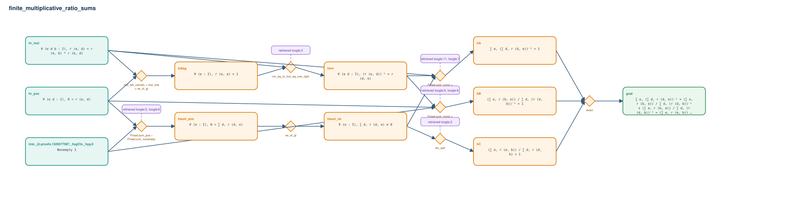

# finite_multiplicative_ratio_sums

- Problem index: `3094`
- arXiv source: `1305.2486`
- Selected nodes / hyperedges: **11 / 8**
- Selected depth: **4**
- Retrieval events matched: **7 / 15**
- Incomplete target InfoTree snapshots audited/excluded: **0**
- Validation: original proof re-elaborated; every edge witness kernel-checked in its Lean local context; selected topology compiled as a separate Lean theorem.
- Axioms: `Classical.choice, Quot.sound, propext`
- Concrete certificate: [semantic_graph_certificate.lean](semantic_graph_certificate.lean) embeds the accepted proof and checks every selected raw witness, premise list, and conclusion against this graph.

## Hyperedges

| Edge | Premises | Conclusion | Rule | Retrieval |
|---|---|---|---|---|
| `h_001_hdiag` | hr_pos, hr_mul | hdiag | `mul_left_cancel₀ + mul_one + ne_of_gt` | — |
| `h_002_hinv` | hr_mul, hdiag | hinv | `inv_eq_of_mul_eq_one_right` | loogle:3 |
| `h_003_hsum_pos` | inst._@.proofs.1328577087._hygCtx._hyg.6, hr_pos | hsum_pos | `Finset.sum_pos + Finset.univ_nonempty` | loogle:5, loogle:6 |
| `h_004_hsum_ne` | hsum_pos | hsum_ne | `ne_of_gt` | — |
| `h_005_ha` | hr_mul, hinv, hsum_ne | hA | `Finset.sum_congr + Finset.sum_div + Finset.sum_mul` | loogle:11, loogle:7, loogle:2, loogle:10 |
| `h_006_hb` | inst._@.proofs.1328577087._hygCtx._hyg.6, hr_pos, hinv | hB | `Finset.sum_congr + Finset.sum_pos + Finset.univ_nonempty` | loogle:5, loogle:6, loogle:2 |
| `h_007_hc` | hsum_ne | hC | `div_self` | loogle:2 |
| `h_goal` | hA, hB, hC | goal | `exact` | — |
