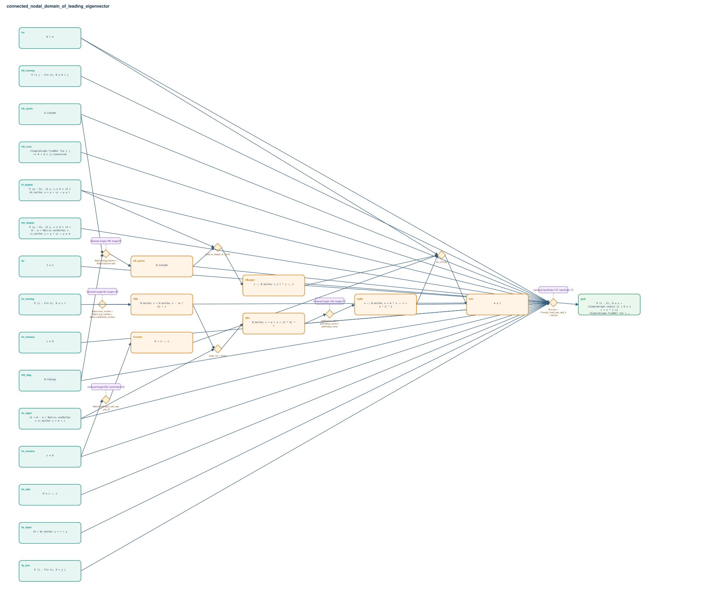

# connected_nodal_domain_of_leading_eigenvector

- Problem index: `3112`
- arXiv source: `1502.01139`
- Selected nodes / hyperedges: **23 / 8**
- Selected depth: **5**
- Retrieval events matched: **13 / 92**
- Incomplete target InfoTree snapshots audited/excluded: **0**
- Validation: original proof re-elaborated; every edge witness kernel-checked in its Lean local context; selected topology compiled as a separate Lean theorem.
- Axioms: `Classical.choice, Quot.sound, propext`
- Concrete certificate: [semantic_graph_certificate.lean](semantic_graph_certificate.lean) embeds the accepted proof and checks every selected raw witness, premise list, and conclusion against this graph.

## Hyperedges

| Edge | Premises | Conclusion | Rule | Retrieval |
|---|---|---|---|---|
| `h_002_hb_symm` | hA_symm, hW_diag | hB_symm | `Matrix.IsDiag.isSymm + Matrix.IsSymm.add` | loogle:188, loogle:51 |
| `h_004_hnormx` | hx_nonzero | hnormx | `Matrix.dotProduct_self_star_pos_iff` | loogle:202, leanfinder:203 |
| `h_005_hmx` | ∅ | hMx | `Matrix.smul_mulVec + Matrix.sub_mulVec + Matrix.vecMulVec_mulVec` | loogle:58, loogle:165, loogle:59, loogle:69 |
| `h_006_hbx` | hx_eigen, hMx | hBx | `congr_fun + funext` | — |
| `h_007_hqbx` | hBx | hqBx | `dotProduct_add + dotProduct_comm + dotProduct_smul` | loogle:149, loogle:151 |
| `h_008_hbupper` | hl_largest, hB_symm | hBupper | `quad_le_largest_of_symm` | — |
| `h_009_hml` | hσ, hnormx, hqBx, hBupper | hml | `sq_nonneg` | — |
| `h_goal` | hn, hA_symm, hA_nonneg, hG_conn, hW_diag, hv_nonzero, hv_nonneg, hσ, hx_nonzero, hx_eigen, hm_largest, hx_sign, hy_pos, hy_eigen, hl_largest, hB_symm, hBx, hqBx, hBupper, hml | goal | `Not.intro + Pi.exists_forall_pos_add_lt + Set.ext` | leanfinder:107, leanfinder:73, loogle:36 |
