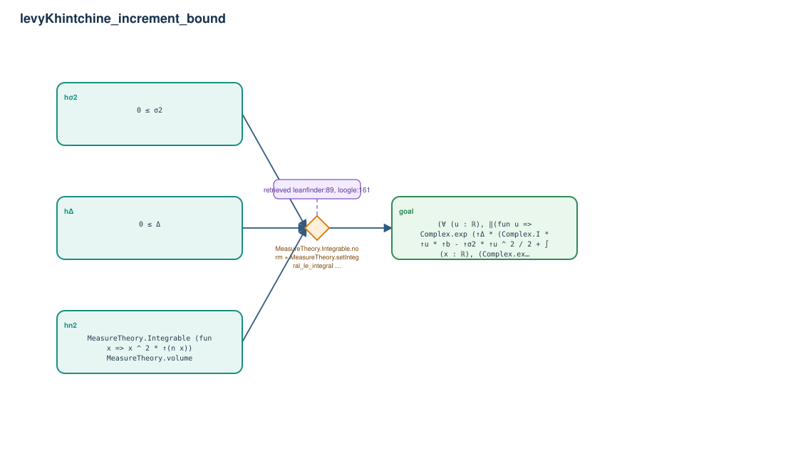

# levyKhintchine_increment_bound

- Problem index: `3184`
- arXiv source: `1105.2424`
- Selected nodes / hyperedges: **4 / 1**
- Selected depth: **1**
- Retrieval events matched: **4 / 91**
- Incomplete target InfoTree snapshots audited/excluded: **0**
- Validation: original proof re-elaborated; every edge witness kernel-checked in its Lean local context; selected topology compiled as a separate Lean theorem.
- Axioms: `Classical.choice, Quot.sound, propext`
- Concrete certificate: [semantic_graph_certificate.lean](semantic_graph_certificate.lean) embeds the accepted proof and checks every selected raw witness, premise list, and conclusion against this graph.

## Hyperedges

| Edge | Premises | Conclusion | Rule | Retrieval |
|---|---|---|---|---|
| `h_goal` | hσ2, hΔ, hn2 | goal | `MeasureTheory.Integrable.norm + MeasureTheory.setIntegral_le_integral + mul_le_mul_of_nonneg_left` | leanfinder:89, loogle:161, leanfinder:4, leanfinder:15 |
