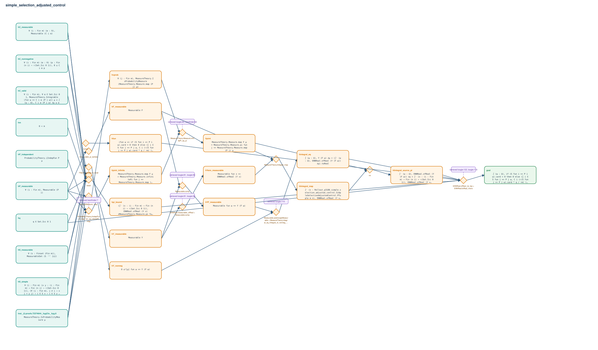

# simple_selection_adjusted_control

- Problem index: `3186`
- arXiv source: `1106.3670`
- Selected nodes / hyperedges: **24 / 14**
- Selected depth: **5**
- Retrieval events matched: **9 / 130**
- Incomplete target InfoTree snapshots audited/excluded: **0**
- Validation: original proof re-elaborated; every edge witness kernel-checked in its Lean local context; selected topology compiled as a separate Lean theorem.
- Axioms: `Classical.choice, Quot.sound, propext`
- Concrete certificate: [semantic_graph_certificate.lean](semantic_graph_certificate.lean) embeds the accepted proof and checks every selected raw witness, premise list, and conclusion against this graph.

## Hyperedges

| Edge | Premises | Conclusion | Rule | Retrieval |
|---|---|---|---|---|
| `h_001_hf_measurable` | hP_measurable | hF_measurable | `measurable_pi_lambda` | — |
| `h_002_hy_measurable` | hS_measurable, hC_measurable | hY_measurable | `exact` | — |
| `h_003_hyf_measurable` | hF_measurable, hY_measurable | hYF_measurable | `Measurable.comp` | loogle:81, loogle:56 |
| `h_004_hy_nonneg` | hC_nonnegative | hY_nonneg | `Filter.Eventually.of_forall` | — |
| `h_005_hintegral_eq` | hYF_measurable, hY_nonneg | hintegral_eq | `Measurable.aestronglyMeasurable + MeasureTheory.integral_eq_lintegral_of_nonneg_ae` | loogle:110 |
| `h_006_hfun` | ∅ | hfun | `funext` | — |
| `h_007_h_prob` | inst._@.proofs.72374644._hygCtx._hyg.8, hP_measurable | hνprob | `MeasureTheory.Measure.isProbabilityMeasure_map` | — |
| `h_008_hjoint_infinite` | inst._@.proofs.72374644._hygCtx._hyg.8, hP_measurable, hP_independent | hjoint_infinite | `ProbabilityTheory.iIndepFun_iff_map_fun_eq_infinitePi_map` | leanfinder:7 |
| `h_009_hjoint` | hνprob, hjoint_infinite | hjoint | `MeasureTheory.Measure.infinitePi_eq_pi` | loogle:60, leanfinder:62, loogle:64 |
| `h_010_hyenn_measurable` | hY_measurable | hYenn_measurable | `ENNReal.measurable_ofReal + Measurable.comp` | loogle:81, loogle:56 |
| `h_011_hlintegral_map` | hF_measurable, hYenn_measurable | hlintegral_map | `MeasureTheory.lintegral_map` | — |
| `h_012_hlintegral_source_pi` | hjoint, hlintegral_map | hlintegral_source_pi | `rw` | — |
| `h_013_hpi_bound` | inst._@.proofs.72374644._hygCtx._hyg.8, hm, hq, hP_measurable, hS_measurable, hS_simple, hC_measurable, hC_nonnegative, hC_valid | hpi_bound | `exact` | — |
| `h_goal` | hq, hintegral_eq, hfun, hlintegral_source_pi, hpi_bound | goal | `ENNReal.ofReal_ne_top + ENNReal.toReal_mono` | loogle:122, loogle:119 |
